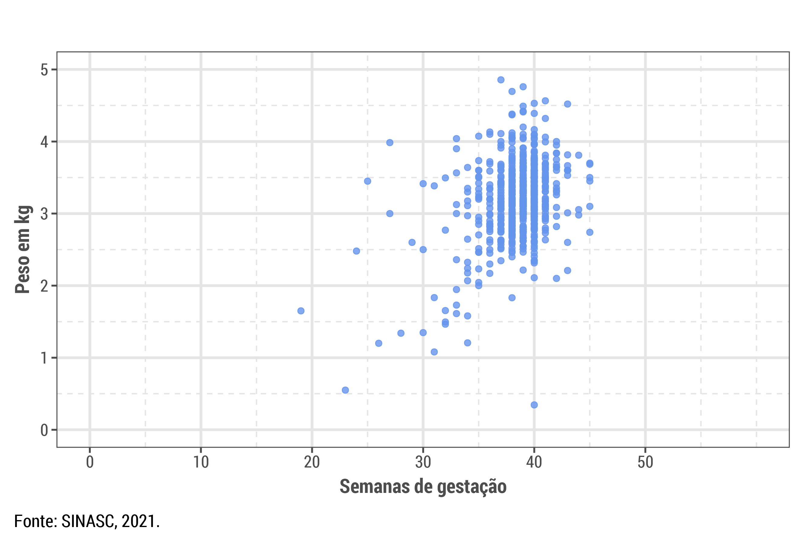
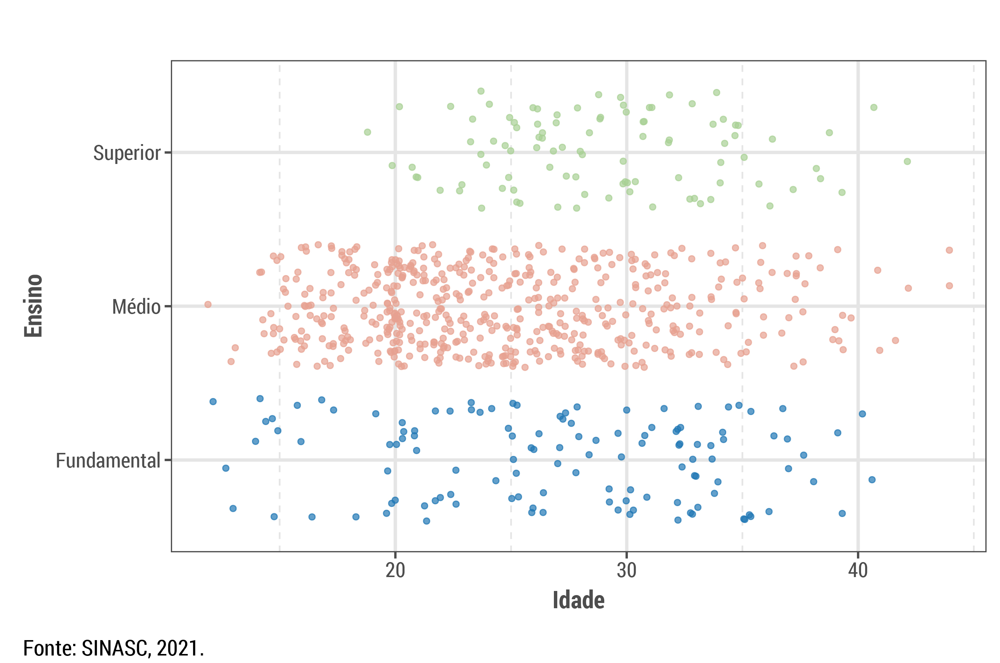

Neste artigo tratará a cerca da análise das complicações das gestações prematuras em mulheres acima de 30 anos, destacando a relação entre idade, escolaridade, semana de gestação e peso dos bebês prematuros.

<!--more-->

## As complicações em gestações prematuras para mulheres acima de 30 anos 

A gestação é um processo complexo que envolve diversos aspectos da saúde física e emocional tanto da mãe quanto do feto. As gestações prematuras representam um problema de saúde pública que afeta milhares de mulheres em todo o mundo. Esse problema se torna ainda mais significativo quando consideramos as complicações na gravidez em mulheres com mais de 30 anos.

Portanto, é de suma importância compreender a análise estatística por trás desses fatores que podem contribuir para a ocorrência do parto prematuro em mulheres mais velhas. Abaixo, apresentamos um gráfico que ilustra a incidência de gestações prematuras em mulheres acima de 30 anos.

  

No que diz respeito às variáveis Semana de Gestação, Idade da Mãe e Consultas mencionadas no gráfico anterior, podemos observar vários fatores que estão relacionados ao nascimento prematuro de bebês. O estudo revela uma maior taxa de natalidade de crianças prematuras em mães mais velhas, baseado em uma amostra de 36 pessoas. Dessas, 20 estão situadas na faixa etária de 30 a 38 anos, com gestações entre 32 e 36 semanas e 7 ou mais consultas médicas. Essa taxa se agrava quando comparada com mães na mesma faixa etária que tiveram gestações entre menos de 22 e 28 a 31 semanas, com apenas 1 a 3 consultas ou nenhuma.

Conforme destacado por Souza (2015), as causas para esse fenômeno podem ser variadas, incluindo a saúde materna, presença de comorbidades médicas, qualidade de vida e outros fatores. Nesse sentido, o nascimento prematuro em mulheres mais velhas pode estar relacionado a complicações na implantação do embrião e no desenvolvimento placentário. Além disso, outros fatores devem ser considerados, como a exposição a fatores de risco, sejam eles ambientais ou relacionados ao estresse, que podem contribuir para o parto prematuro.

Entretanto, é fundamental ressaltar que as análises realizadas aqui não estabelecem uma relação direta entre uma variável e outra. Cada caso é único, e nem todas as mulheres mais velhas terão um parto prematuro, assim como nem todas as gestações com outras características resultarão em nascimentos prematuros.

### Relação entre semana de gestação e peso em kg

  

No gráfico acima, apresenta-se o diagrama de dispersão que relaciona o peso com a semana de gestação em mulheres com idades entre 12 e 45 anos. No subconjunto das mulheres acima de 30 anos, observamos uma amostra composta por 19 mulheres, divididas entre os intervalos de gestação de menos de 22 a 36 semanas e pesos de 1 a 3 quilogramas.

Notou-se que a maioria dos casos se concentra nos intervalos de 2 a 3 quilogramas, com 32 a 36 semanas de gestação, abrangendo sete pessoas, e de 1 a 2 quilogramas, também com 32 a 36 semanas de gestação, com seis casos. Esta análise está relacionada novamente à variável da gestação, mas agora considerando a relação com o peso dos bebês prematuros. Este cenário é comum, pois é amplamente conhecido que quanto menor a semana de gestação, menor a quantidade de nutrientes que o bebê recebe durante o desenvolvimento no útero. Isso, por sua vez, está diretamente ligado ao menor peso e à estrutura orgânica reduzida do recém-nascido.

A grande maioria dos bebês prematuros, como indicado neste estudo e como pode ser observado no gráfico anterior, nasce com peso abaixo da média esperada para bebês nascidos a termo.

###  Relação entre escolaridade e idade da mãe

  

Já neste gráfico, podemos observar condições que, à primeira vista, podem parecer difíceis de relacionar, mas o estudo realizado revelou o contrário. Um exemplo notável é a relação entre o nível de instrução e a taxa de nascimentos prematuros. Na amostra de 36 mães com mais de 30 anos que tiveram gestações com menos de 37 semanas, notou-se que nenhuma delas possuía ensino superior. Uma análise mais detalhada desses 36 indivíduos revela que 6 estavam distribuídos em gestações com menos de 22 a 31 semanas, com apenas uma mulher tendo completado o ensino médio.

De acordo com Kramer et al. (2000), a falta de educação pode afetar a capacidade das mulheres de acessar informações cruciais sobre saúde e cuidados pré-natais adequados. Mulheres com menor nível de escolaridade podem ter menos acesso a informações precisas e atualizadas sobre saúde reprodutiva, incluindo a prevenção de complicações durante a gravidez e o parto.

Nessas três análises que abrangem as variáveis Idade da Mãe, Escolaridade, Gestação e Peso, percebe-se que essas quatro variáveis estão de alguma forma correlacionadas, embora não diretamente. O nascimento prematuro, como evidenciado no gráfico da relação entre semana de gestação e peso, frequentemente ocorre em bebês com peso entre 1 kg e 3 kg, principalmente quando as mães são mais velhas, o que aumenta ainda mais o risco. Ao comparar Idade da Mãe e Escolaridade, observa-se que à medida que a idade das mães aumenta além dos 30 anos, o número de mulheres com ensino superior diminui, o que, por sua vez, reduz o acesso à informação e diminui a frequência das consultas pré-natais, aumentando os riscos de nascimento prematuro.

Além disso, a falta de recursos financeiros, frequentemente causada pela ausência de ensino superior em mulheres mais velhas, pode limitar o acesso a serviços públicos de qualidade, como exames pré-natais regulares e assistência ao parto por profissionais qualificados.

## Referências

KRAMER, M. S. et al. Socio-economic disparities in pregnancy outcome: why do the poor fare so poorly? Paediatric and perinatal epidemiology, v. 14, n. 3, p. 194-210, 2000. Disponível em: <a href="https://doi.org/10.1007/s11042-022-12153-2" target="_blank" style="color:#016dea; text-decoration: none;" onmouseover="this.style.color='#014ba0';" onmouseout="this.style.color='#016dea';">https://onlinelibrary.wiley.com/doi/abs/10.1046/j.1365-3016.2000.00265.x</a>. Acesso em: 19 mar. 2021.

MENEZES, A. L. Como assim, cultura da pedofilia? Politize. 2022. Disponível em: <a href="https://doi.org/10.1007/s11042-022-12153-2" target="_blank" style="color:#016dea; text-decoration: none;" onmouseover="this.style.color='#014ba0';" onmouseout="this.style.color='#016dea';">https://www.politize.com.br/cultura-do-estupro-como-assim/</a>. Acesso em: 19 mar. 2021.

SOUZA, R. T. Uma análise do parto prematuro terapêutico no contexto da prematuridade no Brasil. Dissertação. Campinas (SP): Universidade Estadual de Campinas, 2015.
